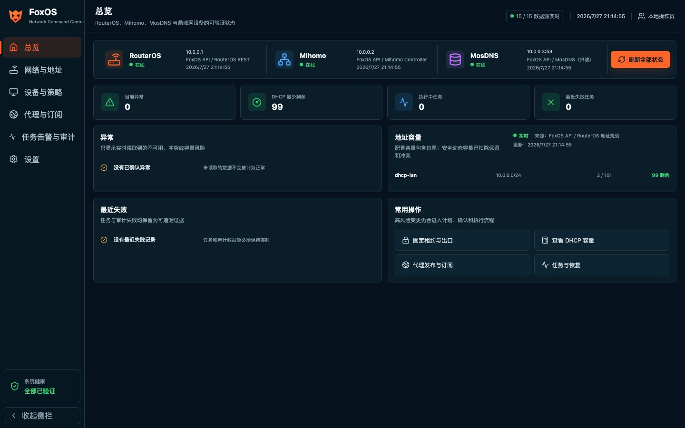

# FoxOS

FoxOS 是面向 RouterOS Container 的网络运维后台，用一个高密度中文控制台管理 RouterOS、Mihomo 与 MosDNS。后端保持 Go 1.24 模块语义并用受支持的 Go 1.25.12 构建发布资产，数据层使用 SQLite；前端使用 React、TypeScript、Vite。

> 发布状态：`agent/foxos-core` 是备用 RouterOS/CHR 验收候选。代码、浏览器、脚本和 Linux 网络命名空间门禁已建立；尚未执行 CHR 或实体 RouterOS 验收，不能把自动化或模拟通过等同于 RouterOS 部署成功。



## 站点清单与管理入口

下表是不可变模板 `deploy/routeros/site-config.example.rsc` 的默认值，不是散落在代码中的强制常量。发布包不携带可执行的 `site-config.rsc`：操作者必须从模板生成唯一清单，审核后用 `seal-site-config.sh` 创建独立 SHA-512，再一起上传。可编辑清单不得直接 import；所有生命周期命令先 import 包内固定的 `load-site-config.rsc`，由它把清单作为数据校验后再加载。预检、安装、DNS、升级、回滚、卸载、后端和前端都从这份封存清单读取。

| 组件 | 默认地址 | 当前职责 |
|---|---|---|
| RouterOS | `10.0.0.1` | 宿主、DHCP、路由、L2TP、Container |
| Mihomo | `10.0.0.2:9090` | Controller、节点、策略组、运行流量 |
| MosDNS | `10.0.0.3:53` | DNS，只读 TCP 状态检查 |
| FoxOS | `https://foxos.home.arpa` / `10.0.0.4:443` | Web、API、SQLite、任务、审计与备份 |

FoxOS 内部 HTTP 仅监听容器 loopback `127.0.0.1:8090`。LAN 上的 TCP 80 只做 308 跳转，Bearer Token API 在启用 HTTPS 时拒绝普通 HTTP。首次启动生成持久本地 CA；客户端必须先核对指纹并导入信任。官方 RouterOS amd64 环境通常报告 `architecture-name=x86`；发布包也兼容非标准目标返回的 `x86_64`，两者都使用 Linux `amd64` 镜像，但后者仍需目标机验收。

## 能力状态

| 验证级别 | 能力 |
|---|---|
| 已自动验证 | 独立数据源状态、轮询/退避、响应式与键盘访问；节点/组/设备资料；Mihomo 基线结构化合并、真实二进制校验、快照、发布和失败回滚；代理链顺序；DHCP 地址规划；按任务类型恢复；订阅、告警、备份、审计 |
| 已在 Linux namespace 模拟验证 | 非 root 绑定 80/443、本地 CA 与 hostname/IP SAN、HTTP 跳转、HTTPS Bearer 门禁、内部 8090 隔离、管理 LAN 路径和普通路由回程；这不是 RouterOS/Container 语义验收 |
| 已实现但要求 RouterOS 前置资源与实机验收 | 动态 Lease 经确认转静态；`direct` 清理、`blocked`、`l2tp` 出口工作流；readiness API 会逐项返回缺失的 anchor、FastTrack、FIB 表或运行会话 |
| 实验性且当前不可用 | `mihomo-node`、`proxy-chain` 设备出口。仅有指向 Mihomo 地址的路由 marker 不是透明数据平面证据；入口、回程、管理旁路、FastTrack 和出口 IP 未全部验证前 API 固定 `available=false` |
| 只读 | RouterOS 资源、接口、WAN/路由、DHCP、容器、L2TP；Mihomo 活动连接、流量、选择器、延迟；MosDNS TCP 可达状态 |
| 暂未开放 | MosDNS 配置写入、DNS 接管、RouterOS 原生 L2TP CRUD、sing-box 渲染/校验、订阅分发/二维码、诊断包导出、多用户/JWT/RBAC |
| CHR 与实体设备未验收 | RouterOS Container 首装/升级、真实 DHCP 写入、阻断/L2TP 流量、Mihomo/MosDNS 联动和物理回滚 |

### 可信状态

页面不会用样例数据冒充在线：

- 每个 RouterOS、Mihomo、MosDNS、设备、策略、节点和审计请求独立加载、成功或失败。
- 单个接口失败只降级对应区域，不会让整页切换到静态数据。
- 每项状态显示来源、最后更新时间，以及加载中、不可用或过期状态。
- 只有对应实时接口明确返回在线，页面才显示在线。
- TCP 建连、Mihomo 节点 HTTP 检查、当前策略出口 IP、RouterOS L2TP 会话分别显示，不互相替代。

### 安全写入闭环

Mihomo：

```text
SQLite 草稿 -> 生成 YAML -> 脱敏 Diff -> 校验 -> 快照
-> 原子替换 -> 热重载 -> Controller 健康验证 -> 失败回滚
```

RouterOS：

```text
读取实际状态 -> 生成精确计划 -> 用户确认 -> 单次签名令牌
-> 允许列表写入 -> 回读验证 -> 审计 -> 失败补偿
```

确认令牌绑定完整计划，五分钟过期且只能使用一次。节点和策略组删除前检查引用，拒绝产生悬空策略。长操作持久化为 `QUEUED`、`RUNNING`、`VERIFYING`、`SUCCEEDED`、`FAILED` 或 `ROLLED_BACK`。重启不会统一重排 `RUNNING/VERIFYING`：Mihomo、RouterOS 出口、订阅、备份创建和恢复各自按阶段检查点回读外部状态，再决定完成、失败或安全重排队。

### DHCP 容量口径

地址池范围首尾都计入容量：`.100-.200` 是 101 个地址，`.10-.254` 是 245 个地址。只有保留地址实际落在该范围内时才从动态容量扣除，例如 `.10-.254` 内排除一个地址后才是 244。规划器从 pool、DHCP network、Lease、RouterOS address 和 ARP 计算冲突、利用率、剩余和耗尽风险；扩容必须提交完整拟议范围并经过 plan/confirm/execute，超过单个 `/24` 的需求会比较 `/23` 与 VLAN 拆分影响，不提供盲目“扩大地址池”开关。

## 快速开发

要求 Go 1.25.12 或更新的受支持版本、Node.js 22.x。`go.mod` 保持 Go 1.24 语言兼容；不要用已停止维护的 Go 1.24 工具链构建生产二进制。

```bash
go mod download
go test ./...

cd web
npm ci
npm run typecheck
npm run test:unit
npm run build
```

启动后端：

```bash
export FOXOS_API_TOKEN="$(openssl rand -hex 32)"
export FOXOS_CONFIRMATION_KEY="$(openssl rand -hex 32)"
export FOXOS_ENV=development
go run ./cmd/server -listen 127.0.0.1:8090 -static web/dist -database data/foxos.db
```

打开 `http://127.0.0.1:8090`，在设置页输入同一个 `FOXOS_API_TOKEN`。浏览器只在同源登录请求中发送一次管理 Token，服务端随后签发 8 小时进程内会话；随机会话值保存在 HttpOnly、SameSite=Strict Cookie 中，CSRF 值只在页面内存中。刷新页面可用 Cookie 恢复会话，服务重启、过期或主动退出后需要重新登录。旧版本遗留在 Web Storage 的 Token 会被迁移一次并立即删除。

## 运行配置

`FOXOS_API_TOKEN` 与 `FOXOS_CONFIRMATION_KEY` 必填、至少 32 字符、不得相同。依赖端点必须是私网或 loopback IP 字面量，禁止 URL 用户信息和开放公网目标。

| 变量 | 全量包值 | 说明 |
|---|---|---|
| `FOXOS_ENV` | `production` | 生产模式强制 HTTPS 和持久绝对路径 |
| `FOXOS_API_TOKEN` | 首次安装随机生成 | 非浏览器 Bearer 与 Web 会话登录使用的管理凭据 |
| `FOXOS_CONFIRMATION_KEY` | 首次安装随机生成 | 高风险计划签名与 Mihomo 配置/快照 keyed digest |
| `FOXOS_SITE_*` | 来自 `site-config.rsc` | 管理桥、存储、网段、服务地址和 public hostname，必须全设或全不设 |
| `FOXOS_ROUTEROS_URL` | 从站点 RouterOS 地址生成 | RouterOS REST 根地址 |
| `FOXOS_ROUTEROS_USERNAME` | `foxos-service` | 专用服务用户 |
| `FOXOS_ROUTEROS_PASSWORD` | 首次安装随机生成 | RouterOS 服务密码 |
| `FOXOS_MIHOMO_URL` | 从站点 Mihomo 地址生成 `:9090` | Mihomo Controller |
| `FOXOS_MIHOMO_PROXY_URL` | 从站点 Mihomo 地址生成 `:7890` | 当前策略出口探测代理，不证明透明代理可用 |
| `FOXOS_MIHOMO_SECRET` | 首次安装随机生成 | Controller Secret |
| `FOXOS_MIHOMO_BASE_CONFIG` | `/data/mihomo/base.yaml` | 可信运行基线 |
| `FOXOS_MIHOMO_LOCAL_CONFIG` | `/data/mihomo/config.yaml` | FoxOS 可写挂载路径 |
| `FOXOS_MIHOMO_RUNTIME_CONFIG` | `/root/.config/mihomo/config.yaml` | Mihomo 进程内配置路径 |
| `FOXOS_MIHOMO_BACKUP_DIR` | `/backups/mihomo` | 发布快照目录 |
| `FOXOS_MIHOMO_VALIDATOR_BINARY` | `/usr/local/bin/mihomo` | 配置语义校验二进制 |
| `FOXOS_MOSDNS_URL` | 从站点 MosDNS 地址生成 `:53` | 仅用于 TCP 53 状态检查 |
| `FOXOS_BACKUP_DIR` | `/backups/foxos` | SQLite/Mihomo 管理备份 |
| `FOXOS_HTTPS_ENABLED` | `true` | 启用非 root HTTPS gateway、CA 和 HTTP 跳转 |
| `FOXOS_SUBSCRIPTION_PRIVATE_CIDRS` | 默认空 | 经管理员审核的 RFC1918/ULA 订阅目标 allowlist，最多 32 个 canonical CIDR |

完整约束见 [运行配置](docs/configuration.md)。

## API

`GET /api/v1/health/live`、`GET /api/v1/health/ready`、`GET /api/v1/site` 和 `GET /api/v1/site/ca` 无需认证。live 只表示进程存活；ready 会真实检查 SQLite、关键挂载以及已配置依赖。site 返回后端实际拓扑、受保护地址、HTTPS 状态和 CA 指纹。

非浏览器 API 客户端对其余接口使用：

```http
Authorization: Bearer <FOXOS_API_TOKEN>
```

Web UI 通过同源 `POST /api/v1/session` 把 Token 换成 HttpOnly Cookie；写请求同时提交 `X-FoxOS-CSRF`。服务端会话只保存在当前 FoxOS 进程内，不是持久登录，也不是 JWT 或多用户会话。

主要接口组：

- 节点与策略组：`/api/v1/nodes`、`/api/v1/proxy-groups`
- 设备与在线历史：`/api/v1/devices`、`/api/v1/device-policies`
- RouterOS 状态：`/api/v1/routeros/overview`、`routes`、`dhcp-servers`、`containers`、`l2tp`
- 受控写入：`/api/v1/routeros/plans/device-binding`、`/api/v1/routeros/plans/dhcp-expansion`、`/api/v1/routeros/plans/egress/{id}`
- 出口 readiness：`GET /api/v1/egress/capabilities`
- Mihomo：`/api/v1/mihomo/draft`、`config/preview`、`config/apply`、`snapshots`、`probes/{id}`
- 运维：`/api/v1/jobs/{id}`、`subscriptions`、`alerts`、`backups`、`audit-events`
- MosDNS：`GET /api/v1/mosdns/overview`，无写入接口

请求体有固定大小上限，错误响应不返回内部密钥。节点读取不会返回密码、UUID 或完整凭据。完整方法和确认流程见 [API 参考](docs/api-reference.md)。

## RouterOS 全量部署包

Core CI 为每个提交生成：

```text
foxos-full-amd64-<commit>.tar.gz
foxos-full-amd64-<commit>.tar.gz.sha256
```

只有同一提交的 `FoxOS Core CI` 与独立 `FoxOS CodeQL` 均为绿色，才可把该提交的全量包交给 CHR 或备用 RouterOS 验收。

发布包包含：

- FoxOS、Mihomo、MosDNS 三个单层、未压缩 Docker v1 tar，供 RouterOS 本地 `file=` 导入。
- `mihomo-config/`、`mosdns-config/`、安装/启动/版本化升级/回滚/卸载脚本。
- 不可变 `site-config.example.rsc`、清单封存工具、只读 doctor/inspector/preflight/plan、可丢弃 CHR container env/mount smoke、`QUICK-INSTALL.md`、`RELEASE-MANIFEST.txt`、组件 `provenance/` 和 `SHA256SUMS`。
- 首次安装随机凭据；仓库和包内不预置真实 Token、密码或节点链接。

三张 amd64 镜像都由同一次 CI 从固定来源构建并分别扫描，再把这些精确输入交给组包器；仓库不跟踪或隐式回退到预制 Mihomo/MosDNS tar。包内 provenance lock 记录上游版本、提交、源码归档 SHA-256、构建器和安全依赖提升。

脚本语法下限是 RouterOS 7.21，目标完整版本还必须先通过同版本 CHR 的 container 契约门禁，实际证明复数 `envlists`、`mountlists`、命名挂载 source 规范化、`mode=rw` 及 add/get/delete；仓库当前没有可替代该门禁的实体版本验收记录。RouterOS 可能给 mount source 回读增加一个前导 `/`，loader 只规范化这一个已知差异，其他路径漂移仍失败关闭。设备还需要同版本 x86 `container` package、`container=yes`、`scheduler=yes`、站点清单指定的现有管理桥和存储，上传完成后仍至少有 512 MiB 可用空间。外置模式要求唯一 `/disk` 槽位；无 `/disk` 对象的 x86 系统盘可显式使用保留根 `foxos`，其他拼写仍按磁盘槽位失败关闭。启用 device-mode 的 container 或 scheduler 可能要求设备操作者按 MikroTik 官方流程进行物理确认；安装器只读检查，不会自行开启。安装器也不会创建管理桥、磁盘、RouterOS 管理地址或 REST 服务。

安全顺序：

1. 在工作站验证外层 `.sha256` 和包内 `SHA256SUMS`。
2. 在目标精确版本的可丢弃 x86 CHR 上运行 `chr-envlists-smoke.rsc`；只接受命令元数据、复数 `envlists`/`mountlists`、mount source 原始值与规范值、`mode=rw` 精确回读、零残留和最终 PASS 同时成立的证据。
3. 复制 `site-config.example.rsc` 为唯一的 `site-config.rsc`，编辑审核后运行 `seal-site-config.sh`；该清单及其 `.sha512` 独立于发布包 checksum。
4. 在任何上传前保存脱敏 export 和 AES 加密 RouterOS binary backup，下载并验证两个副本；逐项确认所有顶层上传目标零碰撞后，才把完整目录、`site-config.rsc` 和 `.sha512` 上传到清单指定的存储根，并通过固定 loader 运行严格只读的 `foxos-doctor.rsc`。
5. 运行 `foxos-plan.rsc`；loader 验证封存清单，plan 再自动执行只读 preflight 和逐资源 `CREATE/REUSE/FAIL` inspector。
6. 把计划输出的 SHA-512 原样设置为确认值，再运行唯一正式安装入口 `foxos-full-install.rsc`；执行器会在首次写入前重跑全部检查并拒绝过期计划。
7. 等三个容器均为 `status=stopped`，运行可重入的 `foxos-start-all.rsc`；失败时只停止本次启动的前序容器，开机自启仍保持关闭。
8. 从站点存储导入生成的 `foxos-local-ca.pem`，核对指纹并设为 trusted；`foxos-verify.rsc` 只有在 live、ready、页面、站点和只读 API 全通过后才启用 FoxOS 所有的顺序启动 scheduler。三个容器的 `start-on-boot` 始终保持 `no`，冷启动由 scheduler 按 Mihomo、MosDNS、FoxOS 顺序协调。
9. 只有客户端原本使用 RouterOS DNS 时，才可单独运行只读 DNS plan、精确确认和 apply，为 public hostname 添加一条 FoxOS 所有的 A 记录。

安装器幂等复用匹配所有权的资源，遇到同名用户资源会失败关闭。服务容器名称是 `foxos-mihomo`、`foxos-mosdns`；首次 FoxOS 管理槽为 `foxos-initial`，后续升级槽为构建时绑定的 `foxos-<release-id>`。活动所有权始终由唯一 `foxos:active` comment 表示，不能从容器名称推断。

完整步骤见 [QUICK-INSTALL](deploy/routeros/QUICK-INSTALL.md) 和 [发布、升级与回滚](docs/release-and-routeros.md)。

### 真实 RouterOS/CHR 验收清单

- 在备用 RouterOS 或 CHR 上核对三个容器的 name/comment、`running`、`start-on-boot=no` 与唯一 enabled 的 `foxos-start-sequence` scheduler，并确认未知用户资源未改变。
- 通过受信任 CA 验证 `https://foxos.home.arpa` 的 live、ready、页面、站点清单和带认证只读 API；确认 LAN 80 只跳转且 8090 不可从 LAN 访问。
- 比较安装前后的 DNS、DHCP network/下发 DNS、默认路由、NAT、Mangle、Filter 与 FastTrack；差异必须与已确认计划一致。
- 使用可恢复测试设备完成普通动态 Lease 的采用、`make-static`、回读、审计和并发外部修改拒绝；复核 `.100-.200=101`、`.10-.254=245`、范围内排除一个才是 244。
- 仅在 capability `available=true` 且前置资源齐全时验证 `blocked` 与 `l2tp` 的真实客户端流量和出口 IP。
- `mihomo-node` 与 `proxy-chain` 当前必须保持不可用；不得用 Controller、route marker 或 mixed port 代替透明入口、回程、管理旁路、FastTrack 和客户端出口证据。
- 在维护窗口演练 pending 升级门禁、SQLite 兼容检查点、自动恢复、应用回滚，并实际验证 RouterOS binary backup、FoxOS manifest 备份和旧镜像/root-dir 恢复路径。

本仓库尚未执行 CHR 或上述实体设备清单，也未在真实主路由部署；当前证据仅来自自动化、静态检查和 Linux namespace，不能外推为 RouterOS 或生产主路由成功。

## 安全边界

- 永久保护站点清单中的 RouterOS、Mihomo、MosDNS 和 FoxOS 地址，禁止为管理地址创建设备策略。
- 不修改 RouterOS DNS、DHCP 下发 DNS、默认路由、NAT、Mangle 或用户防火墙。
- 不接管没有 `foxos:` 所有权标识的 RouterOS 资源。
- 出口执行器要求预置且回读验证 FoxOS anchor/路由表/网关；活动 FastTrack 会导致计划失败。Mihomo 两种设备出口目前无论 marker 是否存在都保持不可用。
- 订阅仅允许 HTTPS 443 且禁止 URL 凭据；默认只允许公共目标。管理员可用 `FOXOS_SUBSCRIPTION_PRIVATE_CIDRS` 精确开放 RFC1918/ULA 网段，但 loopback、link-local、multicast、unspecified 和 metadata 类地址始终拒绝。每次连接和重定向都会重新解析，最多三次重定向、2 MiB、15 秒。
- RouterOS/Mihomo/MosDNS 配置端点只允许私网或 loopback IP 字面量，并禁用重定向。
- 持有 `foxos-env` 凭据的 FoxOS 管理容器固定 `logging=no`；RouterOS 会把启用容器日志时的启动环境写入系统日志。Mihomo 与 MosDNS 不继承 FoxOS 凭据，可保留运行日志。
- CSP、HSTS、安全响应头和 API `no-store` 已启用；容器以 UID 10001 运行，仅二进制持有绑定 80/443 所需 capability。
- FoxOS 对 MosDNS 保持只读；MosDNS 自身未认证的 9099 API 仅监听容器 loopback，未使用的第三方管理 UI 不进入发布包。L2TP 密码不会进入 API、日志或数据库输出。
- 当前是单一管理 Token 模型：非浏览器使用 Bearer，Web 使用短期服务端会话；没有 JWT、多用户或 RBAC。不要把 443、RouterOS REST、Mihomo Controller/mixed port 暴露到 WAN。8090 仅应存在于 FoxOS loopback。

不要提交密钥、节点链接、密码、Token、RouterOS 导出或真实公网信息。

## 备份、恢复与升级

FoxOS 备份包含 SQLite 和已配置的 Mihomo 配置，记录 SHA-256 清单，默认保留最近 20 份。恢复必须先获取预览与一次性确认令牌；恢复后校验 SQLite 与 Mihomo，失败时补偿，并保留任务和审计结果。Mihomo v2 apply journal 不只认证配置身份，还用独立领域 HMAC 覆盖操作身份、目标 digest、期望快照 label、备份路径、阶段和时间等完整恢复 envelope；重启只有在 envelope、SQLite 快照和当前运行配置全部一致时才清理 journal。

RouterOS 升级使用 release ID 绑定的版本化 pending/active/rollback 槽位。promote 前由旧版本创建 SQLite 兼容回滚点；pending 在保留 pending 所有权时启动，只有自动通过 running、live、ready、页面和带认证只读 API 后才切换所有权。每次写入 promoted 前（包括 switched 重试）都会再次执行同等联合验收并回读槽位身份。pending 启动或首次验收失败会请求恢复旧容器；所有权已切换后若最终验收失败或 promoted 响应仍不确定，则保留新 active 和 stopped rollback，禁止自动 abort 或回滚，重新运行版本化 promote plan 收敛。旧二进制启动前按升级检查点恢复兼容数据库。实体流量验收和回滚演练后，必须通过摘要确认的 cleanup 把旧 rollback 归档为 retained，才能开始下一次升级；确认式卸载默认保留所有数据、镜像、配置、root-dir、备份和本地 CA。恢复与升级细节见 [备份恢复](docs/backup-restore.md) 和 [发布文档](docs/release-and-routeros.md)。

## 故障排查

| 现象 | 先检查 |
|---|---|
| 页面所有数据源不可用 | CA 信任、HTTPS、浏览器会话是否过期、401/403、FoxOS live/ready |
| 只有 RouterOS 不可用 | REST URL、专用账号权限、www/www-ssl 访问范围、bridge 连通 |
| 只有 Mihomo 不可用 | Controller 9090、Secret、配置挂载、Controller 日志 |
| MosDNS 不可用 | TCP 53 监听、`FOXOS_MOSDNS_URL`、容器状态 |
| 出口计划被拒绝 | capability `missing`、静态 IP、管理面保护、FoxOS anchor、FIB 表、L2TP 会话、FastTrack；Mihomo 出口当前预期不可用 |
| 发布后回滚 | 对应持久任务、Mihomo Controller、快照目录和审计错误分类 |
| 容器无法启动 | 架构、同版本 container package、`container=yes`、`scheduler=yes`、磁盘、`/log/print where topics~"container"` |

故障材料必须先脱敏。不要上传 Authorization header、env list values、分享链接或 RouterOS export。

## 质量门禁

分支 push/PR 门禁执行：

- Go 1.24：module compatibility、module verify、gofmt、vet、全量测试、覆盖率和 race。
- Go 1.25 最新补丁：发布二进制与 FoxOS 镜像构建、golangci-lint、gosec、govulncheck；Trivy 分别阻止三张交付镜像中有修复版本的 HIGH/CRITICAL 漏洞。
- Web：npm clean install、应用与 Playwright 配置独立 TypeScript 检查、Vitest、npm audit、production build。
- Playwright：桌面、平板、390px 移动端，覆盖深链接、浏览器前进后退、键盘、焦点锁定、失败降级、危险确认、发布与回滚。
- 独立 `FoxOS CodeQL` workflow 分析 Go 与 TypeScript；Core CI 运行 Trivy、RouterOS 脚本静态检查、敏感材料和生成物检查。
- Linux network namespace：非 root 80/443、CA/HTTPS、跳转、回程、管理路径和 fail-closed 出口 readiness。
- amd64 FoxOS、Mihomo、MosDNS 三镜像与全量 RouterOS 包构建、运行契约、校验和及 Artifact 上传。Release workflow 另为裸 Go 二进制与每张镜像 tar 生成独立 `SHA256SUMS` 和 CycloneDX SBOM。Mihomo 校验器和独立运行时共用 SHA-256 固定的官方 `v1.19.29` 源码与加固二进制；MosDNS 固定 `jasonxtt/mosdns` 的 `2ac30e867a7b...`。两者使用 Go 1.26.5，把命中的 `x/crypto`、`x/net`、`x/text`（Mihomo 另含 `x/oauth2`）提升到已修复版本，并以仅含静态二进制、CA、时区数据和空 `/tmp` 的 scratch 运行时交付。

本地完整命令：

```bash
go test -race -shuffle=on -count=1 ./...
cd web
npm run typecheck
npm run typecheck:e2e
npm run test:unit
npm run build
npm run test:e2e
cd ..
scripts/check-routeros-scripts.sh
scripts/check-sensitive-material.sh
```

## 项目与文档

```text
cmd/server/                 HTTP 服务入口
cmd/routeros-image/         RouterOS 单层镜像转换
internal/api/               API、认证和确认边界
internal/mihomo/            生成、发布、探测和回滚
internal/routeros/          读取、计划、Writer、验证和补偿
internal/subscription/      安全抓取、预览、更新和调度
internal/task/              持久任务与恢复
internal/backup/            备份与恢复
internal/store/sqlite/      SQLite 持久化
web/                        React UI、Vitest、Playwright
deploy/routeros/            RouterOS 部署脚本
scripts/                    质量与组包脚本
```

- [总体架构](docs/architecture.md)
- [API 参考](docs/api-reference.md)
- [运行配置](docs/configuration.md)
- [设备策略](docs/device-management.md)
- [操作确认](docs/operation-confirmation.md)
- [备份恢复](docs/backup-restore.md)
- [Web/API 状态语义](docs/web-api-integration.md)
- [RouterOS 连接](docs/routeros-setup.md)
- [RouterOS 全量安装](deploy/routeros/QUICK-INSTALL.md)
- [发布、升级与回滚](docs/release-and-routeros.md)

自动化和模拟组包只能证明代码与资产一致。真实 RouterOS 写入前仍必须展示设备上的精确计划、影响范围、备份和回滚路径，并由操作者明确确认。
